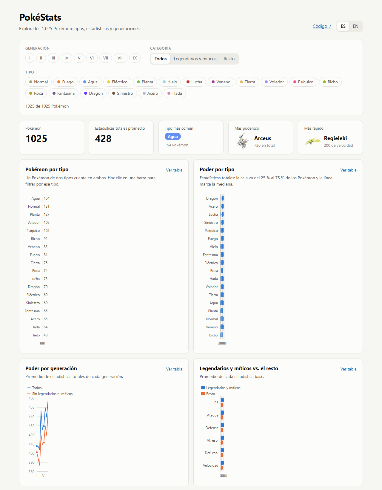

# PokéStats

Dashboard interactivo con datos de los 1.025 Pokémon: tipos, estadísticas base, generaciones y efectividad entre tipos. En español e inglés.

**[Ver en vivo →](https://optickal095.github.io/pokestats/)**



## Qué muestra

- **Indicadores:** cantidad de Pokémon, promedio de estadísticas totales, tipo más común, el más poderoso y el más rápido.
- **Filtros** por generación, tipo y categoría (legendarios y míticos o el resto). Todos los gráficos y números se actualizan juntos, y hacer clic en una barra de tipo también filtra.
- **Pokémon por tipo**, **poder por tipo** (diagrama de caja), **poder por generación** (con y sin legendarios), **legendarios vs. el resto**, **altura vs. peso** (escalas logarítmicas) y la **tabla de efectividad** entre los 18 tipos.
- **Comparador** de hasta 3 Pokémon, con buscador por nombre o número en ambos idiomas.
- **Ficha de cada Pokémon** (estadísticas, generación, tamaño y cadena evolutiva navegable). Se abre desde el comparador, los indicadores o un punto del gráfico de altura vs. peso.
- **Cada gráfico tiene su vista de tabla**, para leer los datos sin depender del color ni del mouse.
- **Español e inglés**, con los nombres oficiales de Pokémon y tipos, y **modo claro y oscuro** según el sistema.

### Decisiones de visualización

- **Paleta validada** para daltonismo y contraste en ambos modos. Los gráficos usan dos colores como máximo, más gris de contexto.
- **Los colores tradicionales de los tipos solo aparecen junto al nombre del tipo** (filtros e indicadores). Con 18 tipos, el color por sí solo no permite distinguirlos.
- **En el comparador, el color sigue al Pokémon:** cada uno conserva su color cuando se quita otro, y todos usan la misma escala (0 a 255, la estadística base más alta).
- **Color decorativo separado del color de datos:** el fondo, el título y las franjas de las tarjetas usan los colores de los tipos solo como decoración (no codifican nada); los gráficos mantienen su paleta validada.
- **Sin gráficos de doble eje:** "poder por generación" compara dos promedios en la misma escala.
- **La tabla de efectividad usa una escala divergente** centrada en ×1 (gris): azul para resistencias e inmunidades, rojo para súper eficaz, con el multiplicador escrito en cada celda.

## Stack

- **React 19 + TypeScript**, con Vite
- **Apache ECharts** para los gráficos, con un componente React propio (sin wrapper) y solo los módulos usados
- **react-i18next** para español e inglés
- **Vitest** para los tests
- Fuente **Outfit** autoalojada con Fontsource (sin peticiones a servicios externos)

## Datos

Los datos vienen de [PokeAPI](https://pokeapi.co). La app no consulta la API en cada visita: un script descarga todo una vez y genera `public/data/pokedex.json` (~320 KB), como pide la [política de uso justo](https://pokeapi.co/docs/v2#fairuse) de PokeAPI. Así el dashboard carga rápido y no depende de que la API esté disponible.

```
PokeAPI (GraphQL, 1 consulta) → PokeApiGraphqlSource → BuildPokedex → JsonFilePokedexWriter → public/data/pokedex.json → app
```

La traducción del esquema de PokeAPI al dominio (`src/infrastructure/pokeapi/transform.ts`) son funciones puras con tests:

- Una entrada por especie: se descartan las formas alternativas (ids desde 10001), aunque PokeAPI marque algunas como "por defecto", como Ursaluna Luna Sangrienta.
- Unidades convertidas: decímetros → metros y hectogramos → kilos.
- Nombres de Pokémon, tipos y generaciones en español e inglés.
- Tabla de efectividad entre los 18 tipos de combate, guardando solo los multiplicadores distintos de ×1.

## Arquitectura

Clean Architecture: las dependencias apuntan solo hacia adentro, y la lógica no sabe de dónde vienen los datos ni cómo se dibujan.

```
src/
├── domain/              Pokémon, Pokédex, filtros, cálculos, búsqueda, evolución y espacios del comparador (TypeScript puro, con tests)
├── application/
│   ├── ports/             PokedexRepository (app) · PokedexSource y PokedexWriter (pipeline de datos)
│   └── use-cases/         BuildPokedex: fuente → Pokédex → escritor
├── infrastructure/      Adaptadores de los puertos
│   ├── pokeapi/           PokeApiGraphqlSource + transform (capa anticorrupción del esquema de PokeAPI)
│   ├── http/              StaticJsonPokedexRepository (lee el JSON publicado)
│   └── node/              JsonFilePokedexWriter (solo Node, lo usa el script)
├── presentation/        React
│   ├── pokedex/           Provider que inyecta el repositorio + hook usePokedex
│   ├── selection/         Ficha abierta y Pokémon comparados (reducer + Provider)
│   ├── components/        Dashboard, filtros (useFilters), indicadores, comparador, buscador, ficha
│   ├── charts/            Componentes de gráficos (solo dibujan) y Chart (envoltorio de ECharts)
│   │   └── options/         Configuración de cada gráfico como funciones puras, con tests
│   ├── i18n/ · theme/     Idiomas y paleta (datos separados del hook usePalette)
└── main.tsx             Raíz de composición de la app
scripts/fetch-data.ts    Raíz de composición del pipeline de datos
```

- **Inversión de dependencias:** los componentes piden el Pokédex a un `PokedexRepository` inyectado con un Provider de React. Cambiar el JSON estático por una API es escribir otro adaptador y cambiar una línea en `main.tsx`.
- **Responsabilidad única:** cada gráfico separa qué datos calcular (dominio), cómo se configura (función pura en `options/`) y cómo se dibuja (componente).
- **Patrones:** Repository y Adapter (fuentes de datos), capa anticorrupción (`transform.ts`), Strategy (grupos del gráfico de dispersión), Reducer para el estado de selección, Provider para la inyección de dependencias.
- **Tests por capa:** dominio y configuraciones de gráficos con funciones puras; caso de uso con dobles de los puertos; adaptadores con un `fetch` falso.

## Desarrollo

```bash
npm install
npm run dev     # http://localhost:5173/pokestats/
npm run data    # vuelve a descargar los datos (solo cuando sale una generación nueva)
npm test
npm run build
```

Cada push a `main` corre tests, lint y build en GitHub Actions y publica `dist/` en GitHub Pages (`.github/workflows/deploy.yml`).

## Hoja de ruta

- [x] Fase 1: pipeline de datos
- [x] Fase 2: dashboard (indicadores, filtros y gráficos), en español e inglés
- [x] Fase 3: comparador y ficha de cada Pokémon
- [x] Fase 4: publicación en GitHub Pages y tarjeta en el portfolio

---

Pokémon y sus nombres son marcas de Nintendo, Game Freak y The Pokémon Company. Proyecto personal sin fines comerciales.
